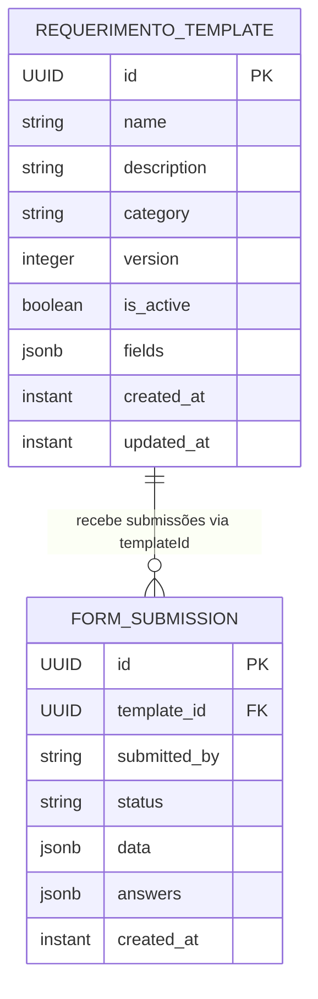
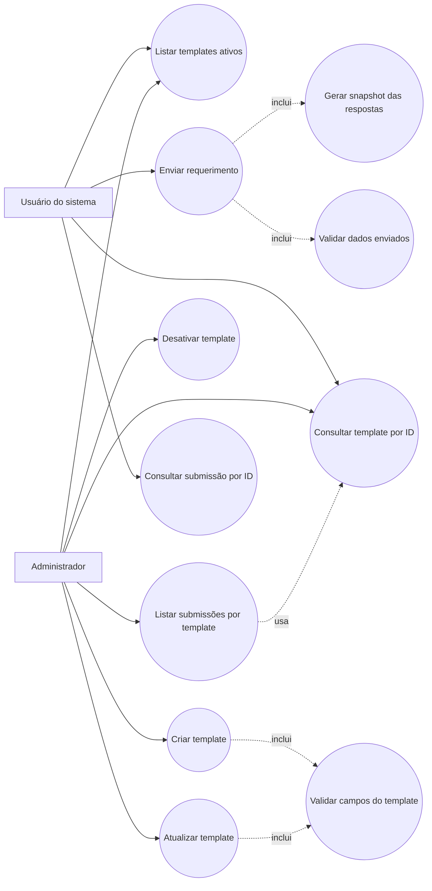

# Diagramas do Sistema de Requerimentos

Este arquivo foi gerado com base no código atual do backend Quarkus em `src/main/java/org/femass/requerimento`.

## Diagrama de Classes

```mermaid
classDiagram
    class RequerimentoTemplate {
        +UUID id
        +String name
        +String description
        +String category
        +Integer version
        +Boolean isActive
        +List~Map~ fields
        +Instant createdAt
        +Instant updatedAt
    }

    class RequerimentoSubmission {
        +UUID id
        +UUID templateId
        +String submittedBy
        +String status
        +Map~String,Object~ data
        +List~Map~ answers
        +Instant createdAt
    }

    class RequerimentoTemplateDTO {
        +UUID id
        +String name
        +String description
        +String category
        +Integer version
        +Boolean isActive
        +List~RequerimentoTemplateFieldDTO~ fields
        +Instant createdAt
        +Instant updatedAt
    }

    class RequerimentoTemplateFieldDTO {
        +String id
        +String fieldKey
        +String label
        +String type
        +Boolean required
        +String placeholder
        +String description
        +List~SelectOptionDTO~ options
        +Integer position
    }

    class SelectOptionDTO {
        +String label
        +String value
    }

    class RequerimentoSubmissionDTO {
        +UUID id
        +UUID templateId
        +String submittedBy
        +String status
        +Instant createdAt
        +Map~String,Object~ data
        +List~RequerimentoSubmissionAnswerDTO~ answers
    }

    class RequerimentoSubmissionAnswerDTO {
        +String fieldKey
        +String label
        +Object value
    }

    class RequerimentoTemplateResource {
        +listActive() List~RequerimentoTemplateDTO~
        +get(UUID id) RequerimentoTemplateDTO
        +create(RequerimentoTemplateDTO dto) Response
        +update(UUID id, RequerimentoTemplateDTO dto) Response
    }

    class RequerimentoSubmissionResource {
        +submit(RequerimentoSubmissionDTO dto) Response
        +byTemplate(UUID templateId) List~RequerimentoSubmissionDTO~
        +get(UUID id) RequerimentoSubmissionDTO
    }

    class RequerimentoTemplateService {
        +listActive() List~RequerimentoTemplate~
        +get(UUID id) RequerimentoTemplate
        +create(RequerimentoTemplate entity) RequerimentoTemplate
        +update(RequerimentoTemplate entity) RequerimentoTemplate
        +deactivate(UUID id) void
    }

    class RequerimentoSubmissionService {
        +get(UUID id) RequerimentoSubmission
        +findByTemplate(UUID templateId) List~RequerimentoSubmission~
        +create(RequerimentoSubmission entity) RequerimentoSubmission
        +updateStatus(UUID id, String status) void
    }

    class RequerimentoTemplateRepository {
        +findActive() List~RequerimentoTemplate~
        +findById(UUID id) RequerimentoTemplate
        +findByCategory(String category) List~RequerimentoTemplate~
    }

    class RequerimentoSubmissionRepository {
        +findByTemplateId(UUID templateId) List~RequerimentoSubmission~
        +findBySubmittedBy(String user) List~RequerimentoSubmission~
        +findByStatus(String status) List~RequerimentoSubmission~
    }

    class RequerimentoTemplateMapper {
        +toDTO(RequerimentoTemplate entity) RequerimentoTemplateDTO
        +toEntity(RequerimentoTemplateDTO dto) RequerimentoTemplate
    }

    class RequerimentoSubmissionMapper {
        +toDTO(RequerimentoSubmission entity) RequerimentoSubmissionDTO
        +toDTO(RequerimentoSubmission entity, RequerimentoTemplate template) RequerimentoSubmissionDTO
        +toEntity(RequerimentoSubmissionDTO dto) RequerimentoSubmission
    }

    class RequerimentoTemplateValidator {
        +validateFields(List~Map~ fields) void
    }

    class RequerimentoSubmissionValidator {
        +validate(RequerimentoTemplate template, RequerimentoSubmission submission) void
    }

    RequerimentoTemplateDTO "1" *-- "0..*" RequerimentoTemplateFieldDTO
    RequerimentoTemplateFieldDTO "1" *-- "0..*" SelectOptionDTO
    RequerimentoSubmissionDTO "1" *-- "0..*" RequerimentoSubmissionAnswerDTO
    RequerimentoTemplate "1" <-- "0..*" RequerimentoSubmission : templateId

    RequerimentoTemplateResource --> RequerimentoTemplateService
    RequerimentoTemplateResource --> RequerimentoTemplateMapper
    RequerimentoTemplateService --> RequerimentoTemplateRepository
    RequerimentoTemplateService --> RequerimentoTemplateValidator
    RequerimentoTemplateMapper --> RequerimentoTemplate
    RequerimentoTemplateMapper --> RequerimentoTemplateDTO

    RequerimentoSubmissionResource --> RequerimentoSubmissionService
    RequerimentoSubmissionResource --> RequerimentoSubmissionMapper
    RequerimentoSubmissionResource --> RequerimentoTemplateService
    RequerimentoSubmissionService --> RequerimentoSubmissionRepository
    RequerimentoSubmissionService --> RequerimentoTemplateRepository
    RequerimentoSubmissionService --> RequerimentoSubmissionValidator
    RequerimentoSubmissionMapper --> RequerimentoSubmission
    RequerimentoSubmissionMapper --> RequerimentoSubmissionDTO
```

## Diagrama Entidade-Relacionamento

## Diagrama de Casos de Uso

Observação: `deactivate(UUID id)` existe no serviço, mas não há endpoint REST exposto para essa ação no código atual.

## Prompt para Gerador de Imagem

Use o prompt abaixo em uma ferramenta de geração de imagem, diagramador com IA ou gerador visual compatível com Mermaid/PlantUML:

> Gere três diagramas técnicos limpos, em português, para um backend Quarkus/Jakarta REST chamado "Sistema de Requerimentos". O estilo deve ser profissional, com fundo branco, caixas arredondadas, texto legível e setas claras.
>
> Diagrama 1: Diagrama de classes. Classes principais: RequerimentoTemplate com atributos id UUID, name String, description String, category String, version Integer, isActive Boolean, fields JSONB List<Map>, createdAt Instant, updatedAt Instant; RequerimentoSubmission com id UUID, templateId UUID, submittedBy String, status String, data JSONB Map<String,Object>, answers JSONB List<Map>, createdAt Instant. DTOs: RequerimentoTemplateDTO, RequerimentoTemplateFieldDTO, SelectOptionDTO, RequerimentoSubmissionDTO, RequerimentoSubmissionAnswerDTO. Camadas: Resources, Services, Repositories, Mappers e Validators. Mostrar dependências: Resource usa Service e Mapper; Service usa Repository e Validator; Mapper converte Entity para DTO; RequerimentoTemplate tem relação 1 para N com RequerimentoSubmission por templateId.
>
> Diagrama 2: Diagrama entidade-relacionamento. Tabelas: requerimento_template e form_submission. requerimento_template possui id PK, name, description, category, version, is_active, fields jsonb, created_at, updated_at. form_submission possui id PK, template_id FK, submitted_by, status, data jsonb, answers jsonb, created_at. Relacionamento: um requerimento_template pode ter zero ou muitas form_submission; cada form_submission pertence a um template via template_id.
>
> Diagrama 3: Diagrama de casos de uso. Atores: Usuário do sistema e Administrador. Usuário pode listar templates ativos, consultar template por ID, enviar requerimento e consultar submissão por ID. Administrador pode listar templates ativos, consultar template por ID, criar template, atualizar template, desativar template e listar submissões por template. Casos incluídos: criar/atualizar template inclui validar campos; enviar requerimento inclui validar dados enviados e gerar snapshot das respostas. Indicar que "desativar template" existe no serviço, mas não está exposto como endpoint REST no código atual.
>
> Organize os três diagramas separadamente, com títulos grandes: "Diagrama de Classes", "Diagrama Entidade-Relacionamento" e "Diagrama de Casos de Uso".
